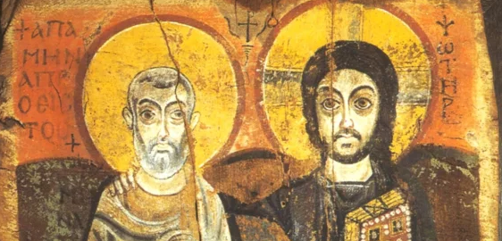

## Overview
### :clock1: When and Where?
Wednesday, 12:15-1:05 pm, [East Pyne 245](https://maps.app.goo.gl/H3TShTd4jb8WNj3WA)

### :speech_balloon: Office Hours
**Thursday, 2:00-4:00 pm**, Study Room 6 at **Firestone Library**.  
If the timing doesn't work for you, please use this link to schedule an appointment: https://calendly.com/luescher-princeton/30min  
I encourage you to attend my Office Hours or sign up online to discuss any questions you have about the readings, assignments (including the final paper), or just chat about the course.

### :e-mail: Communication
In addition to my office hours, I also encourage you to use email to ask questions relating to minor aspects of the seminar. If you send me an email at luescher@princeton.edu, I will generally respond within 24 hours on weekdays, although I may at times be slower. You are welcome to email me at any time of day, but please note that I do not typically respond after 6:00 pm or before 9:00 am on weekdays, and am unlikely to respond over the weekend. I do not expect you to respond to my emails right away, but rather at a time that’s convenient for you. If I need an answer within a specific timeframe, I will include it in my email and ensure you have ample time to respond.

### :clipboard: [Policies](#policies)

## :pushpin: Reminder
The use of ChatGPT or other generative AI programs is **not** permitted for the completion any of the assignments in this class. Any work that a student turns in that has been written with a generative AI program, in part or in whole, will receive a **grade of 0**.  
Precept participation counts for **10%** of the final grade, but if you fail to receive a passing mark for the precept you will fail the class.

## Precept Sessions
- [Week 02 | **Sep 10**](#september-10)
- [Week 03 | **Sep 17**](#september-17)
- [Week 04 | **Sep 24**](#september-24)  
- [Week 05 | **Oct 1**](#october-1)  
- [Week 06 | **Oct 8**:exclamation:Midterm Exam:exclamation:](#october-8)  

### :fallen_leaf: Fall Break :fallen_leaf:

- [Week 07 | **Oct 22**](#october-22)
- [Week 08 | **Oct 29**](#october-29)
- [Week 09 | **Nov 5**](#november-5)
- [Week 10 | **Nov 12**](#november-12)
- [Week 11 | **Nov 19**](#november-19)
- [Week 12 | **Nov ?**](#november)

### :turkey: Thanksgiving :pie:

- [Week 13 | **Dec 3** | Last Day of Classes](#december-3)
- [**Dec 10**:exclamation:Paper Due:exclamation:](#december-10)
- [**Dec 17**:exclamation:Final Exam:exclamation:](#december-17)

## September 10
#### Week 2
### :book: Readings
- (Ps.-?) Aelius Aristides, “Regarding the Emperor.” From Charles A. Behr, P. *Aelius Aristides. The Complete Works. Volume II: Orations XVII-LIII.* Leiden, 1981, pp. 185-192.
- Excerpts on the life of Origen in Eusebius, *Church History 6.* [G.A. Williamson, trans., revised by Andrew Louth, *Eusebius: The History of the Church from Christ to Constantine* (London/New York, 1989), pp. 179-185, 193-209].
### :brain: Guiding Questions

[Go back to the top](#overview)

## September 17
#### Week 3
### :book: Readings
- Lactantius, *On The Deaths of the Persecutors* (pp. 11-79 in J.L. Creed, ed. and trans., *Lactantius: De Mortibus Persecutorium,* [Oxford, 1984]).
- “The Martyrdom of Phileas, Bishop of Thmouis,” in R. MacMullen and E.N. Lane, *Paganism and Christianity: 100-425 C.E.: A Sourcebook* (Minneapolis, 1992), pp. 234-238.
### :brain: Guiding Questions

[Go back to the top](#overview)

## September 24
#### Week 4
### :book: Readings
- Eusebius, *Life of Constantine* (pp. 67-104; 120-127; 140-141, 143-147; 158-163; 167-168; 172; 174-182, in Av. Cameron and S.G. Hall, trans., *Eusebius: Life of Constantine* (Oxford, 1999)).
*As you read, think of how the accounts of Eusebius and Lactantius overlap and compare them.*
### :brain: Guiding Questions

[Go back to the top](#overview)

## October 1
#### Week 5
### :book: Readings
- Athanasius, *On the Incarnation* (trans. J. Behr, (Yonkers, 2011)), pp. 49-110.
### :brain: Guiding Questions

## October 8
#### Week 6
### :exclamation:Midterm Exam:exclamation:
In-person, **closed book** midterm exam. No outside material such as class notes, textbooks, reference works, internet websites, friends, or anything other than you own mind are allowed.
Two parts:
1. **IDs**  
ID’s will be drawn from term sheets distributed each class
2. **Short Essays**  
Essays will focus on larger issues addressed in class lectures and assigned readings.

[Go back to the top](#overview)

## :fallen_leaf: Fall Break :fallen_leaf:

## October 22
#### Week 7
### :book: Readings
- Athanasius, *Life of Anthony* (pp. 7-70 in C. White, Early Christian Lives)
- The Sayings of Anthony the Great, the Sayings of Abba Nilus and the Sayings of Abba Xanthias, pp. 1-9, 153-154, 159 in B. Ward, trans. *The Sayings of the Desert Fathers: The Alphabetical Collection* (Kalamazoo, 1975).
- P. Brown, ‘The Rise and Function of the Holy Man in Late Antiquity,’ *Journal of Roman Studies* 61 (1971), pp. 80-101.
### :brain: Guiding Questions
[Go back to the top](#overview)

## October 29
#### Week 8
### :book: Readings
- Jerome, *The Life of Paula the Elder* (Letter 108, To Eustochium), pp. 74-108 in C. White, trans., *Lives of Roman Christian Women* (London, 2010).
- Gerontius, *The Life of Melania the Younger*, pp. 179-230 in C. White, trans., *Lives of Roman Christian Women*.
- Watch documentary film, ‘Conversations in Cairo" available via Canvas.
### :brain: Guiding Questions
[Go back to the top](#overview)

## November 5
#### Week 9
### :book: Readings
- Prokopios, *The Secret History* (excerpts), pp. 28-132 in A. Kaldellis trans. *Prokopios: The Secret History, with related texts* (Indianapolis/Cambridge, 2010).
### :brain: Guiding Questions

[Go back to the top](#overview)

## November 12
#### Week 10
### :book: Readings
- John of Ephesus, *Third Part of the Ecclesiastical History of John of Ephesus*, trans. R.P. Smith (Oxford, 1860), pp. 432-433. (Prof. Tannous will put a photocopy of relevant pages on electronic reserve, but the text can also be found here: http://www.tertullian.org/fathers/ephesus_7_book6.htm. NB: You will need to scroll down to pp. 432-433 in the text to see it).
- *The Chronicle of Monemvasia*, in P. Charanis, ‘The Chronicle of Monemvasia and the question of the Slavonic settlements in Greece,’ *Dumbarton Oaks Papers* 5 (1950), p. 148.
- *Chronicle of Joshua the Stylite* (excerpt), pp. 8-22, 51-109, from F.R. Trombley and J.Watt, trans., *The Chronicle of Pseudo-Joshua the Stylite* (Liverpool, 2000).
### :brain: Guiding Questions

[Go back to the top](#overview)

## November 19
#### Week 11
### :book: Readings
- *The Qur’an* (trans. M.A.S. Abdel Haleem). Read *sura*s: 1, 9, 12, 14, 17, 18, 19, 20, 26, 30, 31, 32, 109, 110, 111, 112, 113, 114.
- S.P. Brock, ‘Syriac Views of Emergent Islam,’ in G.H.A. Juynboll, ed., *Studies on the First Century of Islamic Society* (Carbondale, Ill., 1982), pp. 87-97.
- al-Ṭabarī, ‘The Messenger of God is Recognized by the Monk Baḥīrā’ in W. Montgomery Watt and M.V. MacDonald, trans., *The History of al-Ṭabarī*, vol. 6, *Muḥammad at Mecca* (Albany, 1988),pp. 44-47.
### :brain: Guiding Questions

**Before the precept, go to this website:**  
https://read.quranexplorer.com/53/3/62/Usmani/Mishari-Rashid/Hide/Tajweed-ON  
Listen to Sura 53 of the Qur’an recited in Arabic (listen only to the Arabic). Listen to it with several different reciters, but include among them Mishari-Rashid. Try to see if you can hear the rhythm of the language.

[Go back to the top](#overview)

## November
#### Week 12
### :book: Readings
- C. Foss, ‘Byzantine Saints in Early Islamic Syria,’ *Analecta Bollandiana* 125 (2007), pp. 93-119.
- Excerpt from *The Apocalypse of Pseudo-Methodius(), trans. S.P. Brock, in A. Palmer, R.G. Hoyland, and S.P. Brock, *The Seventh-Century in the West Syrian Chronicles* (Liverpool, 1993), pp. 230-242.
- John of Damascus, *On the Divine Images*, in J.W. Coakley and A. Sterk, *Readings in World Christian History* (Maryknoll, NY, 2004), pp. 289-302.
### :brain: Guiding Questions

[Go back to the top](#overview)

## :turkey: Thanksgiving :pie:

## December 3
#### Week 13
### :book: Readings
- Translation of excerpt from the Risāla of al-Ḥasan b. Muḥammad b. al-Ḥanafiyya, Arabic text in J. van Ess, Anfänge Muslimischer Theologie (Beirut, 1977).
- S.P. Brock, ‘Two sets of Monothelete questions to the Maximianists,’ *Orientalia Lovaniensia Periodica* 17 (1986), pp. 133-140.
Excerpts from various Arabic texts on the nature and method of translation, taken from pp. 17-23 in F. Rosenthal, trans., *The Classical Heritage in Islam* (London/New York, 1975).
- Al-Ṭurṭūshī, ‘The Pact of ‘Umar,’ (taken from *Sirāj al-Mulūk*) and al-Shāfiʽī, ‘The Pact to Be Accorded to Non-Muslim Subjects,’ (taken from *Kitab al-Umm*), translated by B. Lewis in *Islam: from the Prophet Muhammad to the Capture of Constantinople*, vol. 2: *Religion and Society*, (New York, 1974), pp. 217-223.
-*The Apocalypse of Samuel, Superior of Deir-el-Qalamoun*, found here: http://www.tertullian.org/fathers/apocalypse_of_samuel_of_kalamoun_02_trans.htm
### :brain: Guiding Questions

[Go back to the top](#overview)

## December 10
### :exclamation:Final Paper Due at 5pm:exclamation:
See Syllabus for more details about the final paper.  
If you choose your own topic, please attend my office hours or arrange an appointment to consult with me.  
Even if you are choosing one of the proposed topics, I encourage you to speak with me about your final paper.  
I would be happy to brainstorm with you, and read and give feedback on your first draft.  
Email me your final paper by 5pm: luescher@princeton.edu

[Go back to the top](#overview)

## December 17
### :exclamation:Final Exam, 4-7pm:exclamation:
In-person, **closed book** final exam. See Syllabus for more details. No outside material such as class notes, textbooks, reference works, internet websites, friends, or anything other than you own mind are allowed.
Two parts:
1. **IDs**  
IDs will be drawn from term sheets distributed each class
2. **Short Essays**  
Essays will focus on larger issues addressed in class lectures and assigned readings.

[Go back to the top](#overview)

## Policies
**Diversity, Inclusion, and Support Statement**  
It is my goal that you and your peers experience our classroom as a safe and productive space where you can learn comfortably. I want to state explicitly that I not only welcome a diversity of backgrounds (including, but not limited to political views, religion, national origin, ancestry, race, color, sex, sexual orientation, gender identity or expression, pregnancy and related conditions, age, marital or domestic partnership status, veteran status, and disability) but believe that it is an asset to all of us. The diversity of voices makes our research stronger, as it broadens the questions we ask and expands the approaches we use, ultimately shaping the answers we find.  
If you believe that experiences in or outside of class are negatively impacting your learning, please feel free to let me know (in person or via email).

**Pronouns**  
Pronouns are an important, yet often overlooked, aspect of daily social interactions. In this class, your pronouns will be respected and used according to your wishes. Please be conscious of your peers’ pronouns and use them accordingly.

**Accessibility**  
Princeton welcomes students with disabilities and values their diverse experiences and perspectives. If you anticipate or experience any barriers to learning in the classroom or when completing assignments or exams, please be aware that support is available to you. If you wish to request classroom accommodations, you can do so through the Office of Disability Services (ODS). If you have been approved for accommodations through the ODS, please contact me via email as soon as possible so we can develop a plan for implementation together.

**Academic Integrity**  
Intellectual honesty is vital to an academic community and for my fair evaluation of your work. For these reasons, all students in this course are expected to abide by the Honor Code on examinations and to complete their written work in accordance with University regulations.

**Generative AI Tools**  
The use of ChatGPT or other generative AI programs is not permitted for the completion any of the assignments in this class. Any work that a student turns in that has been written with a generative AI program, in part or in whole, will receive a grade of 0. Every single word of any written assignment that is turned in with your name on it should be written by you and not by generative artificial intelligence.  

[Go back to the top](#overview)